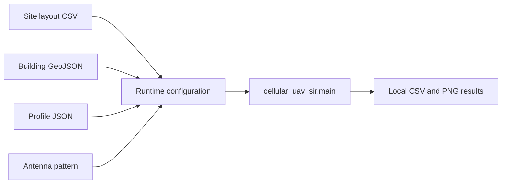

# Cellular + UAV Reuse Simulation

_蜂窝与低空融合网络频率复用、SIR/SINR 和传播损耗仿真代码。_

---

## 📋 项目概览

本仓库提供可复现的蜂窝网络与无人机用户仿真，覆盖以下实验：

- 六边形频率复用解析基线与 Monte Carlo SIR/SINR
- 不同高度下的 UAV 链路、LOS/NLOS、阴影衰落和小尺度衰落
- 三扇区天线方向图、波束码本和同频干扰筛选
- 动态 UAV 轨迹、负载、切换、功率分配和协调调度
- 基于站点 CSV 与建筑 GeoJSON 的公开数据输入处理

默认仿真使用仓库内的必要输入文件，不需要联网。公开数据准备工具只有在显式运行时才访问外部数据服务；数据来源和处理边界见 [DATA_SOURCES.md](DATA_SOURCES.md)。



## 🚀 快速运行

### 环境要求

- Python 3.10 或更高版本
- Windows PowerShell、Linux shell 或 macOS shell

### 安装依赖并运行

```powershell
python -m venv .venv
.venv\Scripts\Activate.ps1
python -m pip install -r requirements.txt
python -m cellular_uav_sir.main
```

运行结果写入 `cellular_uav_sir/results/`。该目录是本地生成目录，已加入 `.gitignore`，不会作为仓库输入提交。

### 使用自定义输入

```powershell
python -m cellular_uav_sir.main `
  --profile-json cellular_uav_sir/data/default_parameter_profile.json `
  --site-layout-csv cellular_uav_sir/data/real_site_layout_knoxville_tn.csv `
  --building-geojson cellular_uav_sir/data/knoxville_site_layout_buildings.geojson `
  --results-dir cellular_uav_sir/results
```

### 运行测试

```powershell
python -m unittest discover -s tests
```

## 🧮 仿真内容

| 模块 | 内容 |
| --- | --- |
| `sir_analytic.py` | 频率复用因子与解析 SIR 基线 |
| `sir_montecarlo.py`、`experiments.py` | 地面用户和 UAV 高度实验 |
| `pathloss.py`、`building_gis.py` | 路损、LOS/NLOS 与建筑遮挡损耗 |
| `antenna.py` | CSV、MSI、PLN 方向图和扇区增益 |
| `dynamic_network.py` | 动态轨迹、切换、负载和干扰协调 |
| `tools/` | 站点、建筑和参数配置准备工具 |

## 📦 仓库输入

必要的运行输入位于 `cellular_uav_sir/data/`，包括参数配置、站点布局、建筑轮廓和天线方向图。默认文件的来源、加工步骤和限制见 [DATA_SOURCES.md](DATA_SOURCES.md)。

动态实验支持站点级覆盖字段，例如扇区方位角、下倾角、发射高度、发射功率、天线增益、`radio` 和 `arfcn`。当服务小区与邻区存在重叠频点时，仿真只将同频邻区计入干扰。

## 🔄 公开数据流程

以下工具接受用户提供的公开数据文件，不把原始下载文件或生成结果作为仓库内容：

1. `tools/extract_arcgis_site_cluster.py`：提取局部公开站点簇
2. `tools/download_osm_buildings.py`：下载站点范围内的建筑轮廓
3. `tools/prepare_enhanced_site_layout.py`：整理 OpenCelliD 或 CellMapper 导出
4. `tools/prepare_overture_3dep_buildings.py`：整理 Overture 建筑数据并可补充 USGS 3DEP 高程
5. `tools/run_public_data_pipeline.py`：串联增强输入、参数校准和对比实验

公开数据的授权、版本和覆盖范围由数据提供方决定。使用外部数据前应核对其当前许可与服务限制。

## 📁 目录结构

```text
cellular_uav_sir/       仿真源代码和必要输入数据
tests/                  单元测试
tools/                  数据准备、校准和运行脚本
.github/workflows/      CI 仿真工作流
requirements.txt        Python 依赖
DATA_SOURCES.md         输入数据来源和处理说明
```

## ⚠️ 适用范围

这是用于传播建模和频率复用分析的仿真项目，不是现场测量数据库、完整三维城市模型或射线追踪系统。仓库内的 Knoxville 站点与建筑数据是局部公开样本；天线 MSI 文件和材料损耗配置是可复现的参考输入，不代表制造商实测数据。

## 📄 许可证

项目许可证见 [LICENSE](LICENSE)。外部数据的许可不因代码仓库许可证而改变。
