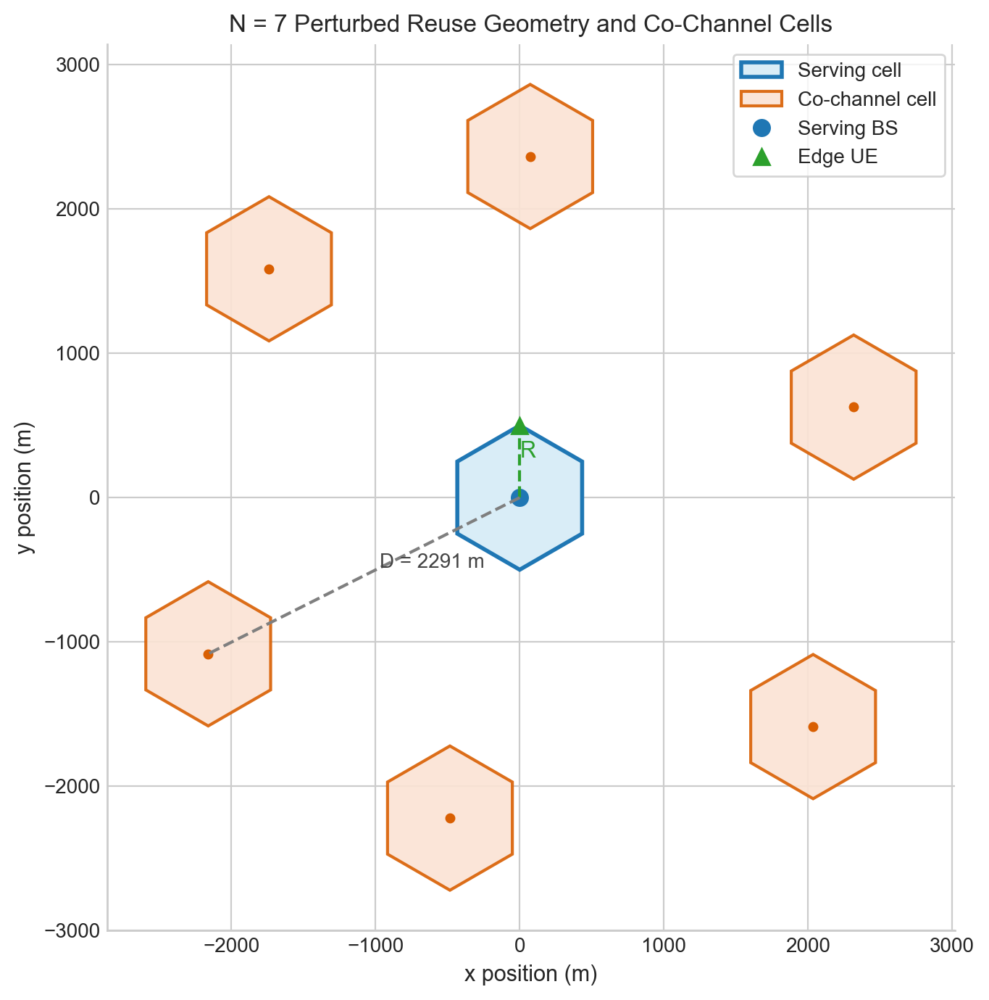
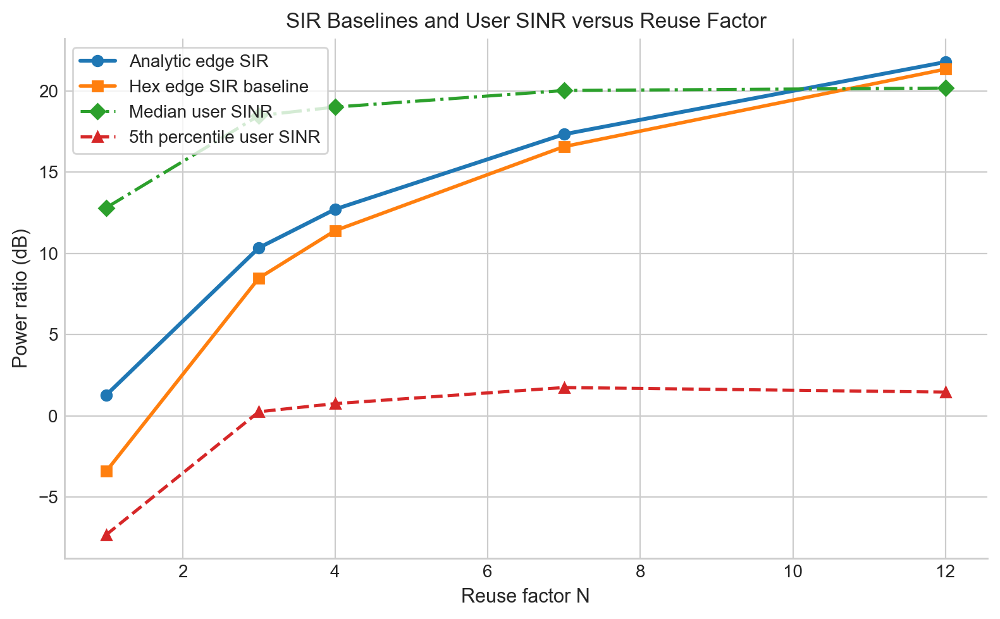
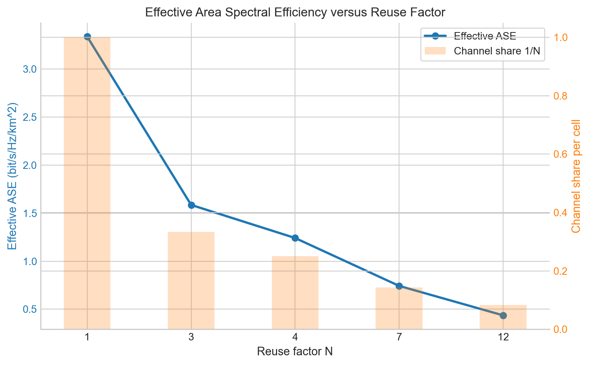
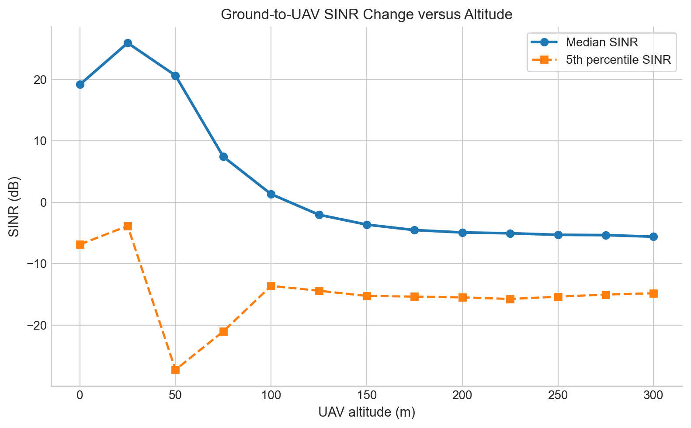
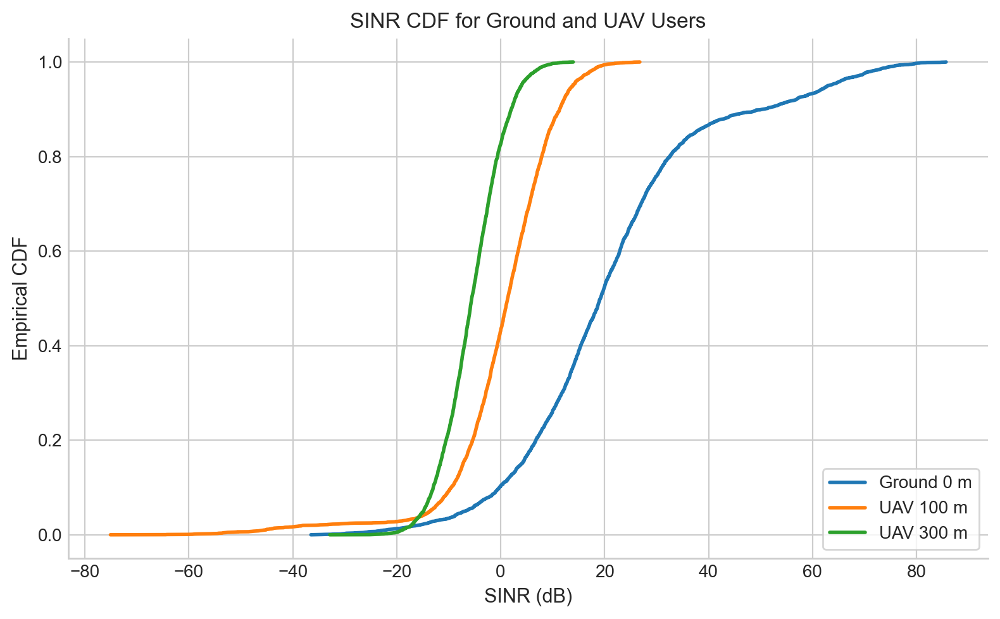
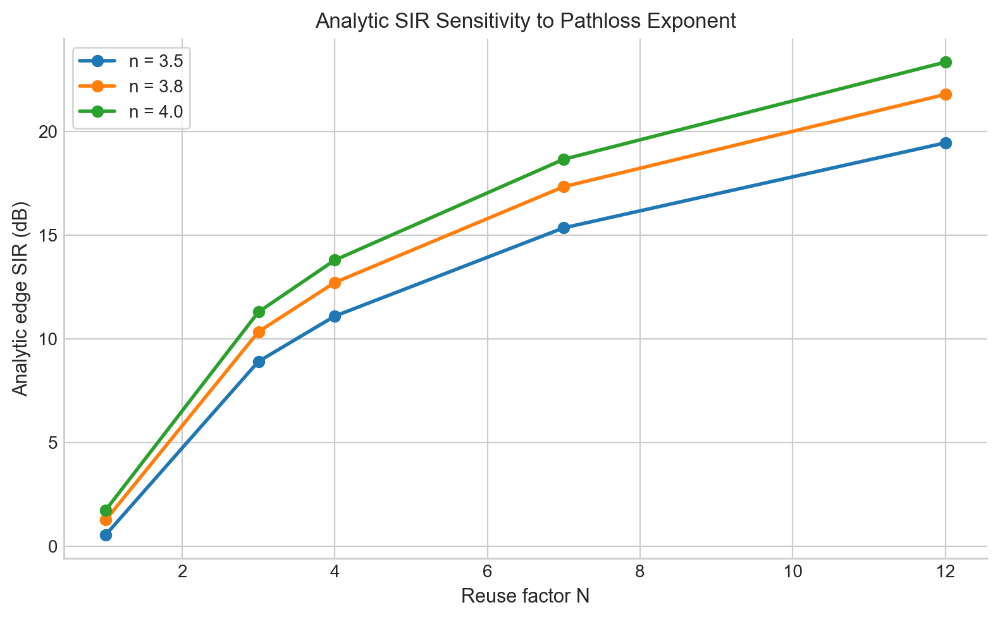
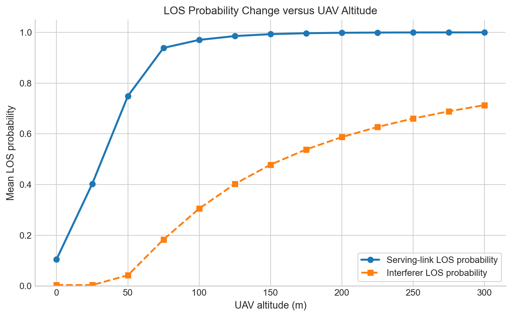
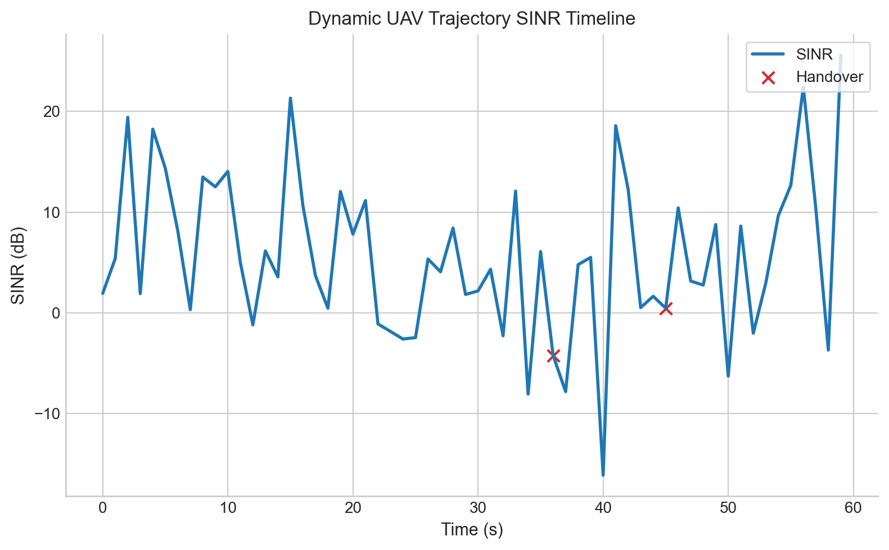
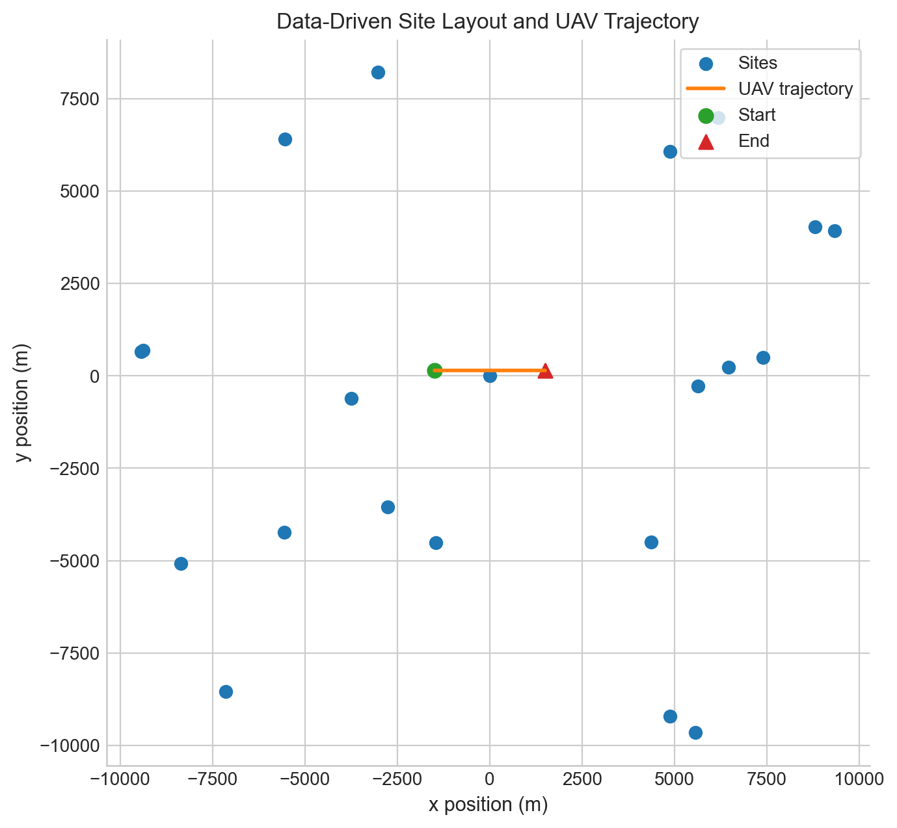

# 蜂窝 + 低空融合网络频率复用与 SINR 仿真研究
*不同复用因子、低空高度变化与真实站址数据驱动场景下的同频干扰和系统容量分析*

**摘要—** 频率复用是蜂窝移动通信系统在有限频谱条件下提升空间复用能力的基本手段，但复用因子变化会同时影响同频干扰水平、边缘链路可靠性和单位面积容量。在传统地面蜂窝网络中，复用因子较小通常意味着更高的频谱利用率，而在低空融合网络中，空中用户的视距（line-of-sight, LOS）链路概率显著增大，同频干扰的空间暴露范围也明显扩大，因此地面蜂窝中的经验结论不能直接套用于低空接入场景。围绕这一问题，本文建立了一个由解析几何模型、静态统计仿真和真实站址数据驱动动态场景组成的研究框架，系统考察不同复用因子下地面用户与低空用户的信干噪比（signal-to-interference-plus-noise ratio, SINR）、有效面积频谱效率（area spectral efficiency, ASE）以及动态链路稳定性。本文首先以六边形蜂窝复用几何为理论起点，构建经典边缘用户信干比（signal-to-interference ratio, SIR）基线；随后在统计仿真中引入热噪声、扇区方向图、俯倾角、阴影衰落、小尺度衰落和低空混合视距/非视距（line-of-sight/non-line-of-sight, LOS/NLOS）概率模型，并采用有效面积频谱效率指标统一比较“链路质量提升”与“空间复用密度下降”之间的折中关系；最后，借助公开真实站址簇和建筑地理数据构造动态低空场景，分析轨迹运动、时变负载、切换事件与建筑遮挡对链路性能的共同影响。需要说明的是，本文属于仿真类课程研究，其中“真实站址数据分析”指基于公开地理数据构建的数据驱动传播场景分析，而非外场无线功率测量。结果表明：当地面路径损耗指数取 $n=3.8$ 时，解析边缘 SIR 由复用因子 $N=1$ 的 1.28 dB 提高到 $N=12$ 的 21.79 dB，随机用户中位 SINR 由 12.82 dB 提高到 20.18 dB，说明增大复用因子能够明显抑制地面同频干扰，但当干扰降低到一定程度后，热噪声成为限制进一步增益的主要因素。在有效面积频谱效率指标下，系统单位面积频谱效率随 $N$ 增大持续下降，由 $N=1$ 时的 3.34 bit/s/Hz/km² 下降到 $N=12$ 时的 0.44 bit/s/Hz/km²，说明更强的复用隔离是以更低的空间复用密度为代价换取的。低空场景中，在 $N=7$ 条件下，无人机用户（unmanned aerial vehicle, UAV）中位 SINR 从 0 m 时的 19.20 dB 上升到 25 m 时的 25.98 dB，随后下降到 300 m 时的 -5.59 dB，呈现“近低空受益、高空退化”的两阶段变化规律。真实站址数据驱动的动态实验进一步表明，在给定 60 s 航迹内，平均 SINR 为 5.63 dB，5% 分位 SINR 为 -6.35 dB，10 dB 门限失效概率为 0.700，说明站址几何、时变负载和切换过程会显著放大低空链路的时间波动。本文认为，低空融合网络中的频率规划不能仅以地面静态覆盖结论为依据，而应联合考虑复用因子、方向图配置、建筑遮挡、站址布局和动态业务过程。若设计目标偏重边缘可靠性与低空覆盖，则应优先采用更保守的复用策略并配合干扰协调；若目标偏重单位面积吞吐量，则较小复用因子仍有优势，但必须接受更高的干扰风险，并通过功率分配与调度机制进行补偿。

**关键词—** 频率复用；低空融合网络；无人机通信；SINR；动态切换；有效面积频谱效率

## I. 引言
无线传播信道决定了通信系统中的覆盖能力、干扰分布和容量边界。对于蜂窝网络而言，频率复用的核心思想是在空间上重复使用有限频谱资源，从而在容量和抗干扰能力之间取得平衡。若复用因子较小，则相同带宽可以被更密集地复用，单位面积吞吐量较高，但同频干扰更强；若复用因子较大，则同频基站间距增大，边缘链路更稳定，但每个小区可独享的频谱比例随之下降。传统课程设计中，这一问题通常以规则六边形蜂窝、地面终端和纯 SIR 指标进行讨论，因此结论清晰、模型简洁，但对低空接入场景的解释能力仍然有限。

近年来，低空经济、无人机巡检、应急通信和空地协同感知等业务快速发展，使蜂窝网络逐步承担低空平台接入任务。与地面终端相比，低空用户的传播环境具有两个突出特征。第一，用户升空后更容易与服务基站形成视距链路，参考信号功率可能增强。第二，空中用户通常可以“看见”更多邻区，同频干扰链路也更容易转化为视距传播，从而导致下行干扰迅速累积。3GPP 关于 aerial UE 的研究已经指出，空中用户在小区重选、切换和下行干扰方面存在区别于地面用户的典型问题 [1]。因此，如果仍沿用只针对地面网络建立的复用设计经验，容易高估低空覆盖能力，低估切换和干扰风险。

已有研究已经从不同角度讨论了蜂窝支持低空接入的可行性与难点。Zeng 等从无人机通信总体视角总结了三维机动性、概率视距链路和空地传播差异对系统设计的影响 [2]。Lin 等进一步结合长期演进（long term evolution, LTE）场景指出，空中终端虽然更容易获得较强的服务信号，但同样更容易遭遇来自多个邻区的下行干扰和频繁移动性事件 [3]。Muruganathan 等对 3GPP Release-15 增强 LTE 支持互联无人机的研究进行了归纳，说明测量、切换和干扰抑制是蜂窝支持低空接入的关键技术环节 [4]。在传播与天线建模方面，ETSI TR 138 901 提供了面向 0.5 至 100 GHz 的三维信道模型框架 [5]，ITU-R P.1410 则给出了城市地物遮挡与宽带接入传播预测方法 [6]。Xu 和 Zeng 的三维天线建模分析表明，低空用户性能不仅受高度影响，还高度依赖基站方向图和俯倾设置 [7]；Euler 等则从移动性角度说明，空中终端在蜂窝网络中更容易出现切换和无线链路失稳问题 [8]。这些一手文献共同说明：低空蜂窝接入的本质不是简单的“高度增加导致路径损耗变化”，而是站址几何、天线方向性、遮挡概率与业务动态共同耦合的系统级问题。

基于上述认识，本文将课程设计目标从“不同复用因子下的地面 SIR 对比”扩展为“地面与低空场景中频率复用、干扰和容量的统一分析”。全文围绕以下问题展开：当复用因子 $N$ 增大时，地面用户的 SIR 与 SINR 如何变化；在引入热噪声与系统开销后，频率复用与有效面积频谱效率之间呈现怎样的折中；低空用户的链路质量为何会随高度先升后降；当研究场景从理想规则蜂窝过渡到公开真实站址簇时，动态链路性能会呈现怎样的时间波动；从这些规律中又可以提炼出哪些频率规划和干扰优化启示。按照课程报告要求，本文采用“引言、理论主体与研究进展、仿真实验结果与真实站址数据分析、分析讨论、结论、参考文献、附录”的结构组织内容，以便与评分标准中的背景认知、理论模型、核心分析和结论展望四个模块逐一对应。

## II. 理论主体与总体研究进展情况

### A. 频率复用问题的研究主线
蜂窝频率复用研究最早关注的核心问题，是在给定小区半径与路径损耗指数的条件下，如何通过调整复用距离抑制同频干扰并保证系统容量。传统理论模型往往在规则六边形蜂窝、全向天线和干扰受限条件下讨论边缘用户 SIR，因此能够给出简洁的闭式表达式。随着三扇区宏站、波束赋形和异构部署逐渐成为现实网络常态，单纯依赖二维规则几何的理论表达已经难以完全覆盖工程现象。对于低空场景，这种不足更加明显，因为用户高度直接改变了服务链路和干扰链路的视距概率分布，也改变了用户相对于下倾主瓣的几何位置。

从总体研究进展看，现有低空蜂窝研究大体沿着三条路径演进。第一条路径是传播机理建模，即通过概率视距模型、三维路径损耗模型和建筑遮挡模型刻画空地链路的统计特性 [2], [5], [6]。第二条路径是系统性能分析，即在蜂窝部署、方向图和功率配置条件下评估空中用户的覆盖、速率和干扰水平 [3], [7]。第三条路径是网络支撑机制，即围绕空中用户的移动性增强、干扰协调和标准演进分析蜂窝网络的可用性边界 [1], [4], [8]。本文的研究定位不是重建一个完整商用网络仿真器，而是在课程理论框架内，将这三条路径中最关键、最能体现物理意义的部分有机结合起来，从而形成一个既可复现、又具备工程解释力的分析模型。

### B. 蜂窝复用几何与解析边缘 SIR
规则六边形蜂窝网络中，复用因子满足

\[
N=i^2+ij+j^2,\quad i,j\in\mathbb{Z}_{\ge 0}. \tag{1}
\]

若小区半径为 $R$，同频小区中心距为 $D$，则经典复用几何关系可写为

\[
\frac{D}{R}=\sqrt{3N}. \tag{2}
\]

式（2）说明，增大复用因子会直接增大同频基站之间的空间间隔，因此理论上能够降低边缘用户所承受的同频干扰。若暂时忽略天线方向性、阴影衰落、小尺度衰落与热噪声，仅考虑距离相关的大尺度路径损耗，则接收功率近似满足

\[
P_r(d)\propto d^{-n}, \tag{3}
\]

其中 $d$ 为传播距离，$n$ 为路径损耗指数。对经典边缘用户场景，只考虑第一圈 6 个主要同频干扰小区时，可得到解析边缘 SIR

\[
\mathrm{SIR}_{\mathrm{edge}}=\frac{1}{6}\left(\frac{D}{R}\right)^n=\frac{(3N)^{n/2}}{6}. \tag{4}
\]

式（4）提供了一个明确的课程理论基线：在其他条件不变时，$N$ 越大，边缘用户理论 SIR 越高。本文后续所有更复杂的静态仿真和动态实验，均以这一理论趋势作为对照，用于判断更真实模型中出现的性能变化是否仍具有清晰的物理解释。

### C. 热噪声、SINR 与绝对功率标定
仅使用 SIR 衡量链路质量，隐含假设系统长期处于典型干扰受限区间。然而当复用因子增大、定向增益提高或部分干扰被抑制时，热噪声会从“可忽略项”转变为“主要约束项”。因此，本文在复用因子比较中引入绝对功率标定，并以 SINR 作为系统主指标。设系统带宽为 $B$，热噪声谱密度为 $N_0$，接收机噪声系数为 $F$，则总噪声功率为

\[
P_N=N_0BF. \tag{5}
\]

本文采用课程设计中常见的无线接入配置，即热噪声谱密度 -174 dBm/Hz、工作带宽 20 MHz、接收机噪声系数 7 dB，对应总噪声功率约为 -93.99 dBm。于是链路质量定义为

\[
\mathrm{SINR}=\frac{P_S}{P_I+P_N}, \tag{6}
\]

其中 $P_S$ 为服务信号功率，$P_I$ 为总干扰功率，$P_N$ 为噪声功率。该定义使得本文既能保留 SIR 对同频干扰强弱的直观描述，也能通过 SINR 准确反映频率复用增益在现实噪声底下的饱和现象。频谱效率评价则继续遵循 Shannon 形式的容量近似 [9]，但计算时以 SINR 代替理想 SIR。

### D. 阴影衰落、小尺度衰落与低空混合 LOS 模型
为避免“规则站址 + 单一路径损耗”带来的过度理想化结果，本文在仿真中引入三类统计因素。第一类是站址扰动，用于反映实际蜂窝部署与理想六边形结构之间的偏差；第二类是阴影衰落，地面链路采用 6 dB 对数正态阴影标准差，低空 LOS/NLOS 链路分别采用 4 dB 和 7 dB；第三类是小尺度衰落，地面链路和 NLOS 链路采用 $m=1$ 的 Nakagami 衰落，LOS 链路采用 $m=3$。因此，单条链路的接收功率可表示为

\[
P_r=P_{\mathrm{tx}}G_{\mathrm{ant}}L(d)X_{\mathrm{sh}}F_{\mathrm{ss}}, \tag{7}
\]

其中 $P_{\mathrm{tx}}$ 为发射功率，$G_{\mathrm{ant}}$ 为方向图增益，$L(d)$ 为距离相关路径损耗，$X_{\mathrm{sh}}$ 为对数正态阴影衰落，$F_{\mathrm{ss}}$ 为小尺度衰落增益。

低空用户场景不适合简单地用“高度增加、路径损耗指数减小”来描述，因为决定性能变化的并不仅是平均路径损耗，还包括服务链路与干扰链路的视距概率变化。本文因此采用三维距离

\[
d_{3\mathrm{D}}=\sqrt{d_{2\mathrm{D}}^2+(h_{\mathrm{BS}}-h_{\mathrm{UT}})^2}, \tag{8}
\]

并在低空传播建模中使用 3GPP UMa 概率视距模型与 ITU 建筑遮挡思想的混合形式 [5], [6]。对较低用户高度，传播更接近城市宏站场景，LOS 概率主要由 3GPP 模型给出；对更高空链路，则逐步混合建筑遮挡统计模型，以反映高空可视范围扩大后的遮挡变化趋势。每条链路先根据 LOS 概率判定为 LOS 或 NLOS，再分别采用不同路径损耗指数、阴影标准差和小尺度衰落参数计算接收功率。这样得到的低空链路模型能够同时保留课程理论中的传播机理与低空网络中的几何直觉。

### E. 方向图、俯倾角与低空干扰放大效应
空中用户并不天然受益于更高高度，因为宏站天线主瓣通常被设计为服务地面覆盖区，存在固定俯倾角。在本文中，蜂窝基站采用典型三扇区部署，主方位分别间隔 120°，并结合机械俯倾与电俯倾构成面向地面服务的空间波束。对于地面用户，这一设计有利于提高本小区覆盖并抑制跨小区干扰；而对于升空用户，其与服务基站的相对仰角不断变化，可能逐步偏离主瓣中心，导致服务方向增益下降。与此同时，高度上升会使更多邻区进入视距传播状态，干扰链路数目和平均增益同时增加。Xu 和 Zeng 的三维天线分析已经表明，低空性能高度依赖方向图设置和俯倾参数 [7]。因此，在频率复用问题中，天线方向性并不是附属因素，而是决定低空链路能否保持可用性的核心变量之一。

### F. 有效面积频谱效率指标
如果仅以

\[
\mathrm{ASE}=\frac{1}{N}\log_2(1+\mathrm{SIR}) \tag{9}
\]

衡量系统性能，则只能反映理想瞬时链路质量，无法体现调度效率、控制开销和覆盖门限的工程代价。本文因此采用有效平均速率

\[
R_{\mathrm{eff}}=\eta_{\mathrm{act}}\eta_{\mathrm{sch}}(1-\eta_{\mathrm{oh}})
\mathbb{E}\left[\mathbf{1}(\mathrm{SINR}\ge \gamma_0)\log_2(1+\mathrm{SINR})\right], \tag{10}
\]

其中 $\eta_{\mathrm{act}}=0.7$ 为资源活跃度，$\eta_{\mathrm{sch}}=0.9$ 为调度效率，$\eta_{\mathrm{oh}}=0.18$ 为控制开销比例，$\gamma_0=10$ dB 为业务可用门限。进一步定义单位面积有效 ASE 为

\[
\mathrm{ASE}_{\mathrm{eff}}=\frac{R_{\mathrm{eff}}}{NA_{\mathrm{cell}}}, \tag{11}
\]

而六边形小区面积为

\[
A_{\mathrm{cell}}=\frac{3\sqrt{3}}{2}R^2. \tag{12}
\]

当 $R=500$ m 时，可得 $A_{\mathrm{cell}}\approx0.6495$ km²。式（10）和式（11）的引入，使本文能够在“链路 SINR 改善”和“空间复用密度下降”之间建立统一比较尺度，也使后续讨论更贴近课程要求中的“系统容量对比”。

## III. 仿真场景与实验设计

### A. 总体场景设置
本文的仿真框架分为三个层次。其一是解析层，用于根据式（1）至式（4）给出不同复用因子的边缘 SIR 基线；其二是静态统计层，在中心小区内进行大量随机用户投放，综合考虑方向图、路径损耗、阴影衰落、小尺度衰落与热噪声，统计地面与低空用户的 SIR、SINR 和有效 ASE；其三是动态数据驱动层，在公开真实站址簇基础上引入低空航迹、时变负载和建筑遮挡，从时间序列角度分析低空链路稳定性。这样的三层结构兼顾了课程理论的可解释性、仿真结果的量化性和真实场景的工程相关性。

### B. 主要参数
主要仿真参数如 Table I 所示。参数设计遵循两个原则：一是尽量与课程中常见的蜂窝传播参数一致，使理论与实验可对应；二是在低空部分引入能体现物理意义的关键因素，而不把模型扩展到难以解释的复杂程度。

**TABLE I** 主要仿真参数设置

| 参数 | 符号 | 取值 |
|---|---|---|
| 小区半径 | $R$ | 500 m |
| 复用因子 | $N$ | 1, 3, 4, 7, 12 |
| 基站高度 | $h_{\mathrm{BS}}$ | 25 m |
| 地面终端参考高度 | $h_{\mathrm{UT,0}}$ | 1.5 m |
| 基站发射功率 | $P_{\mathrm{tx}}$ | 46 dBm |
| 工作带宽 | $B$ | 20 MHz |
| 接收机噪声系数 | $F$ | 7 dB |
| 载频 | $f_c$ | 3.5 GHz |
| Monte Carlo 样本数 | - | 4000 |
| LOS / NLOS 路径损耗指数 | $n_{\mathrm{LOS}}/n_{\mathrm{NLOS}}$ | 2.2 / 3.8 |
| 地面路径损耗指数 | $n_g$ | 3.8 |
| UAV 高度范围 | $h$ | 0 m 至 300 m，步长 25 m |
| 地面 / 低空同频干扰站数量 | - | 18 / 42 |
| 机械 / 电俯倾 | - | 4° / 8° |
| 峰值面板增益 | - | 17 dBi |
| 波束阵列增益 | - | 6 dB |
| 地面阴影衰落标准差 | - | 6 dB |
| LOS / NLOS 阴影衰落标准差 | - | 4 dB / 7 dB |
| 地面 / LOS / NLOS Nakagami $m$ | - | 1 / 3 / 1 |
| 资源活跃度 / 调度效率 / 控制开销 | - | 0.7 / 0.9 / 0.18 |
| 有效业务门限 | $\gamma_0$ | 10 dB |
| 动态时间步数 | - | 60 |
| 动态步长 | - | 1 s |
| 动态 UAV 高度 | - | 120 m |
| 切换滞回 | - | 2.5 dB |
| 最小驻留步数 | - | 3 |

### C. 真实站址与建筑地理数据
由于本课题属于仿真类研究，本文没有进行外场接收功率测试，而是采用公开真实站址数据和建筑地理数据构造“数据驱动传播场景”。站址数据来自公开塔站数据库，在美国一处城市中心区附近提取出 21 个高密度站点，并转换到局部平面坐标系中，以保留真实站址间距、相对方位和局部聚簇结构。建筑数据来自公开建筑轮廓数据库，通过边界覆盖、分块抓取和去重处理形成站址簇范围内的建筑遮挡样本。本文使用这些地理数据完成两项任务：一是替代理想规则蜂窝中的统计站址扰动，使动态实验具备真实站址几何；二是在低空链路中引入建筑遮挡判决和附加损耗近似，使传播环境更接近城市条件。

需要强调的是，公开站址和建筑轮廓数据并不等价于运营商全网的精确商用配置，也不包含完整的三维材质和射线追踪信息。因此，本文的真实站址数据分析更适合用于研究“站址几何—遮挡—切换—负载”之间的耦合机理，而不是对某一商用网络作一比一精确复盘。

### D. 对照实验设计
为满足评分标准中“多组对照实验”和“逐条解读量化结果”的要求，本文设计四组实验。第一组实验比较不同复用因子下地面用户的解析边缘 SIR、统计中位 SIR 和中位 SINR，从而验证课程复用理论在更真实模型下是否仍然成立。第二组实验比较不同复用因子下的有效 ASE，用于揭示频率复用与系统容量之间的折中关系。第三组实验在固定复用因子 $N=7$ 下扫描不同低空高度，分析空中用户 SINR、覆盖概率、有效 ASE 和 LOS 概率的变化。第四组实验引入真实站址数据驱动的动态场景，在低空航迹、时变负载和建筑遮挡共同作用下分析时间序列 SINR、切换次数和链路失效概率。

Fig. 1 给出了本文采用的蜂窝复用几何示意。该图对应式（1）至式（4）所描述的理论背景，能够直观反映复用因子变化如何改变服务小区与同频干扰小区之间的相对位置关系。

*Fig. 1. Hexagonal frequency-reuse geometry used for the baseline interference analysis.*

## IV. 仿真实验结果与真实站址数据分析

### A. 复用因子对地面用户 SIR 与 SINR 的影响
Table II 给出了不同复用因子下的地面用户结果。从解析边缘 SIR、几何边缘 SIR、随机用户中位 SIR 到中位 SINR，整体趋势都随 $N$ 增大而改善，这说明经典复用理论在引入更真实传播因素后仍然保留了正确方向。但同时可以看到，SINR 的提升幅度明显小于 SIR。这是因为当复用因子较大、同频干扰显著减弱后，系统逐渐从典型干扰受限状态过渡到“干扰与热噪声共同约束”状态，噪声底开始限制进一步性能增长。

**TABLE II** 不同复用因子下的地面用户 SIR / SINR

| $N$ | 解析边缘 SIR / dB | 六边形边缘 SIR / dB | 中位用户 SIR / dB | 中位用户 SINR / dB | 5% 分位 SINR / dB |
|---|---:|---:|---:|---:|---:|
| 1 | 1.28 | -3.41 | 14.25 | 12.82 | -7.32 |
| 3 | 10.35 | 8.48 | 24.99 | 18.49 | 0.26 |
| 4 | 12.72 | 11.41 | 27.32 | 19.02 | 0.76 |
| 7 | 17.34 | 16.58 | 32.21 | 20.03 | 1.75 |
| 12 | 21.79 | 21.35 | 36.59 | 20.18 | 1.47 |

从边缘用户角度看，$N=1$ 到 $N=12$ 的解析 SIR 提升约 20.5 dB，说明复用距离增大对抑制同频干扰具有显著作用。可是在随机用户统计结果中，中位 SINR 仅从 12.82 dB 提升到 20.18 dB，增益约 7.4 dB，远小于中位 SIR 的增长幅度。这一差异直接证明：若仅观察 SIR，会高估增大复用因子所带来的实际系统收益。因此，在蜂窝容量分析中，将 SIR 与 SINR 分开讨论是必要的。

Fig. 2 进一步用曲线形式展示了不同复用因子下的 SIR 变化趋势。相较于表格，曲线图更容易看出解析结果与统计结果在趋势上保持一致，但统计曲线在小复用因子区域受随机传播因素影响更明显。

*Fig. 2. SIR performance versus reuse factor under the ground-user scenario.*

### B. 复用因子对有效面积频谱效率的影响
Table III 给出了不同复用因子下的平均链路速率和有效 ASE。结果显示，随着 $N$ 增大，平均链路质量持续改善，平均用户 SINR 速率也有所增长，但单位面积有效 ASE 却单调下降。这说明频率复用设计中的核心矛盾并不是“干扰越小越好”，而是“单链路质量改善”与“空间复用密度下降”之间的竞争。若仅从单用户速率角度看，大复用因子似乎更优；但若以系统容量为准，则小复用因子仍然保有明显优势。

**TABLE III** 不同复用因子下的有效频谱效率

| $N$ | 平均用户 SIR 速率 / bit/s/Hz | 平均用户 SINR 速率 / bit/s/Hz | 有效速率 / bit/s/Hz | 有效 ASE / bit/s/Hz/cell | 有效 ASE / bit/s/Hz/km² |
|---|---:|---:|---:|---:|---:|
| 1 | 5.30 | 4.85 | 2.17 | 2.17 | 3.34 |
| 3 | 8.44 | 6.42 | 3.09 | 1.03 | 1.59 |
| 4 | 9.23 | 6.63 | 3.23 | 0.81 | 1.24 |
| 7 | 10.80 | 6.89 | 3.38 | 0.48 | 0.74 |
| 12 | 12.27 | 6.95 | 3.40 | 0.28 | 0.44 |

对比 Table II 和 Table III 可以看出，地面网络中的复用因子选择不存在单一最优解。若以边缘鲁棒性或服务可靠性为优先目标，较大的 $N$ 更有利，因为它显著改善了弱覆盖用户的干扰环境；但若以单位面积有效吞吐量为目标，则 $N=1$ 仍然是最有利的选择。课程理论中的“复用—容量折中”在这里得到了更完整的量化验证。

这种折中关系在 Fig. 3 中表现得更直观。随着复用因子增大，面积频谱效率呈现稳定下降趋势，说明系统容量最优点并不必然对应最佳边缘链路质量。

*Fig. 3. Effective area spectral efficiency versus reuse factor.*

### C. 低空用户高度变化下的静态性能
Table IV 给出了固定复用因子 $N=7$ 时不同低空高度的静态结果。最显著的现象是，UAV 用户中位 SINR 并不随高度单调变化，而是在近低空区间先升后降：从 0 m 的 19.20 dB 提升到 25 m 的 25.98 dB，之后快速下降，在 100 m 仅剩 1.34 dB，到 300 m 已降至 -5.59 dB。覆盖概率和有效 ASE 的变化趋势与之高度一致，说明这一现象不是单一指标的偶然波动，而是传播机理变化的集中体现。

**TABLE IV** 典型高度下的低空用户静态性能

| 高度 / m | 中位 SIR / dB | 中位 SINR / dB | 10 dB 覆盖概率 | 有效 ASE / bit/s/Hz/km² | 服务 LOS 概率 | 干扰 LOS 概率 |
|---|---:|---:|---:|---:|---:|---:|
| 0 | 29.65 | 19.20 | 0.7373 | 0.8055 | 0.1051 | 0.0039 |
| 25 | 36.61 | 25.98 | 0.7933 | 1.1923 | 0.4024 | 0.0036 |
| 50 | 21.57 | 20.67 | 0.7025 | 0.7850 | 0.7489 | 0.0422 |
| 100 | 1.34 | 1.34 | 0.1303 | 0.0689 | 0.9703 | 0.3052 |
| 200 | -4.91 | -4.91 | 0.0095 | 0.0045 | 0.9985 | 0.5870 |
| 300 | -5.59 | -5.59 | 0.0033 | 0.0015 | 0.9999 | 0.7130 |

从物理意义上看，25 m 附近的性能峰值反映了一个“低空甜点区间”。在这一区间内，用户升空后服务链路更容易转为 LOS，接收功率明显改善；但邻区干扰链路的 LOS 概率尚未大规模上升，因此净效应表现为 SINR 增强。超过这一高度后，越来越多同频干扰小区进入视距传播区间，系统迅速转入干扰主导状态。由此可见，低空接入的关键并不只是“用户升高后是否更容易被基站看见”，而在于“服务增强与干扰累积谁增长得更快”。

Fig. 4 展示了高度扫描下的链路性能曲线，可以更清晰地看出 25 m 附近的性能峰值以及 100 m 以后快速退化的趋势。Fig. 5 则给出了典型高度下的 SINR 分布差异，说明高空退化不仅表现为均值下降，也表现为整条分布向低 SINR 区域整体移动。

*Fig. 4. Link-quality variation versus UAV altitude.*

*Fig. 5. CDF of link quality at representative UAV altitudes.*

### D. 低空传播机理的统一解释
Table IV 背后的机制可以从服务链路与干扰链路的同步变化来理解。首先，服务 LOS 概率由 0 m 时的 0.105 增长到 25 m 时的 0.402，再到 100 m 时的 0.970，说明随着升空，用户越来越容易与服务基站形成视距传播。其次，宏站主瓣存在固定俯倾，用户继续升高后会逐渐偏离主瓣中心，导致服务方向增益下降。再次，干扰 LOS 概率在 0 m 时仅为 0.0039，而到 300 m 时增长到 0.713，说明高空用户会同时暴露于更多视距干扰链路之下。Xu 和 Zeng 的三维天线分析同样强调了低空链路对方向图和仰角几何的高度敏感性 [7]。

因此，低空 SINR 的先升后降可以被概括为三阶段演化。第一阶段是近低空阶段，服务 LOS 概率增大快于干扰累积，SINR 上升；第二阶段是过渡阶段，服务增强与邻区干扰增强同时出现，SINR 开始回落；第三阶段是高空阶段，主瓣失配与 LOS 干扰累积共同主导，系统进入“高干扰 + 噪声底”的双重约束区间。该结果说明，在低空融合网络中，用户高度不能被简单视为有利因素，而必须结合方向图和复用策略综合判断。

Fig. 6 给出了不同路径损耗指数下的理论趋势对比，说明传播指数变化会改变解析 SIR 的绝对水平，但不会改变“复用因子增大可抑制干扰、同时牺牲空间复用密度”的基本结论。Fig. 7 则进一步显示，服务链路与干扰链路的 LOS 概率会随高度发生系统性变化，这也是解释 Fig. 4 中先升后降现象的重要依据。

*Fig. 6. Analytical SIR trend under different path-loss exponents.*

*Fig. 7. LOS-probability variation versus UAV altitude.*

### E. 真实站址数据驱动的动态链路分析
为了进一步观察低空链路在现实部署条件下的时域行为，本文引入了公开真实站址簇和建筑地理数据，构建 60 s 的低空飞行航迹，并在每个时间步内考虑时变负载、切换滞回、最小驻留时间、功率分配和建筑遮挡。Table V 给出了动态实验的总结结果。与静态结果相比，动态场景下的平均 SINR 仅为 5.63 dB，5% 分位 SINR 降至 -6.35 dB，10 dB 门限失效概率达到 0.700，说明时域波动对链路稳定性的影响远大于单次静态快照所揭示的平均性能。

**TABLE V** 真实站址数据驱动动态低空实验总结

| 指标 | 数值 |
|---|---:|
| 时间步数 | 60 |
| 切换次数 | 2 |
| 平均 SIR / dB | 5.65 |
| 平均 SINR / dB | 5.63 |
| 5% 分位 SINR / dB | -6.35 |
| 平均速率 / bit/s/Hz | 1.52 |
| 10 dB 门限失效概率 | 0.7000 |
| 平均服务负载 | 0.5296 |
| 平均邻区负载 | 0.6299 |

Table V 的意义不只在于给出一个平均数，而在于说明真实站址几何和动态业务过程会显著改变低空链路的时间结构。平均服务负载和平均邻区负载相近，表明干扰并不来源于单一强干扰站，而是与多个邻区的资源活动共同相关。切换次数虽然不高，但链路失效概率仍然偏大，说明低空链路的不稳定并不完全由“频繁切换”引起，还与高空干扰可见范围扩大、局部遮挡和负载波动密切相关。换言之，低空网络中的动态问题是“站址几何—传播环境—移动性—资源负载”的耦合问题，而不是一个单独的射频参数问题。

这种时域波动可由 Fig. 8 直接观察到，其中链路质量在时间轴上呈现出明显的起伏变化。Fig. 9 给出了真实站址数据驱动场景下的站址布局与航迹关系，说明低空用户的动态性能与几何位置变化密切相关。

*Fig. 8. Dynamic SINR timeline for the UAV trajectory in the real-site scenario.*

*Fig. 9. Real-site layout and UAV trajectory in the data-driven dynamic scenario.*

## V. 分析与讨论

### A. 复用因子选择体现了可靠性与容量的基本张力
本文最稳定、最清晰的结果，是复用因子对不同目标函数的影响方向并不一致。当地面用户以链路质量为主目标时，复用因子增大能够显著压低同频干扰，解析边缘 SIR 和统计中位 SINR 均表现为上升趋势；但当评价尺度切换为单位面积有效 ASE 后，复用因子增大反而使系统总频谱产出持续下降。这一现象在课程理论上具有直接意义：频率复用本质上不是“寻找一个绝对最优的 $N$”，而是在“边缘可靠性”和“面积容量”之间做任务导向型折中。若服务对象以低码率可靠链路为主，例如应急巡检或低空控制链路，则较大的复用因子更有利；若服务对象以持续数据吞吐为主，则较小复用因子仍然更具容量优势。

### B. 低空链路存在有限高度受益窗口，而非单调高度增益
低空用户静态实验表明，用户高度并不是一个可以简单正向理解的变量。25 m 附近出现的性能峰值说明，低空接入确实可能从更高的服务 LOS 概率中获益；但当高度继续上升到 100 m 以上时，邻区 LOS 干扰增长远快于服务链路收益，系统性能发生陡降。这一结果与 LTE 支持无人机和三维天线分析相关研究的结论一致，即空中用户面临的主要挑战不是单纯的“远距覆盖”，而是“多邻区可见导致的下行干扰与移动性问题” [3], [7], [8]。从工程角度看，这意味着低空融合网络需要区分不同高度层的资源策略。对近低空业务，可以在现有地面蜂窝配置基础上适度优化；对较高空业务，则更需要借助波束控制、干扰协调和专用资源管理，而不能简单复用地面网络参数。

### C. 真实站址数据揭示了动态低空网络的真正瓶颈
如果只看静态中位数结果，很容易得到“系统仍可工作”的结论；但动态实验表明，真实站址几何和时变业务过程会使低空链路出现明显的时间波动。即使平均 SINR 达到 5.63 dB，10 dB 门限失效概率仍高达 0.700，这意味着多数时间步并不能满足较高质量业务要求。这个结果对课程分析非常重要，因为它提示我们：面向低空网络的频率复用设计不能只依赖空间平均指标，必须额外关注切换过程、链路尾部风险和业务门限失效概率。Muruganathan 等对 3GPP Release-15 的总结和 Euler 等的移动性分析都说明，空中用户更容易触发测量事件、暴露于更多邻区并产生移动性问题 [4], [8]。本文的动态数据驱动实验在课程尺度上复现了这一趋势，从而使分析讨论部分不再停留于静态传播规律，而能够上升到系统级时间稳定性视角。

### D. 模型适用边界与后续深化方向
尽管本文已经把课程理论、统计传播模型和公开真实站址数据结合起来，但模型仍有明确边界。首先，本文使用的是公开站址与建筑轮廓数据，能够反映真实几何关系，却不代表运营商商用网络的完整配置，因此更适合研究相对规律而非绝对 KPI。其次，建筑遮挡采用的是几何遮挡与附加损耗近似，尚未引入完整城市三维材质数据库和严格射线追踪，因此更适合解释“遮挡是否会改变 LOS 传播趋势”，而不适合替代高保真城市级传播仿真。再次，低空动态过程虽然考虑了切换、负载与功率分配，但尚未完整纳入厂商级 MIMO 码本、跨小区协作波束和真实商用功控。也正因为如此，本文的价值主要在于建立一个具有物理清晰性和工程启发性的分析框架，而不是把问题封装成黑箱式复杂仿真器。对于课程报告而言，这种边界清晰的建模方式更有利于体现理论掌握、物理理解和独立分析能力。

## VI. 结论与展望
本文围绕“蜂窝 + 低空融合网络中的频率复用与同频干扰”这一课程主题，构建了一个由解析理论、静态统计仿真和真实站址数据驱动动态场景组成的研究框架，并在地面用户和低空用户两类场景下对复用因子、链路质量和系统容量进行了统一分析。研究表明，复用因子增大能够显著改善地面用户的 SIR 和 SINR，但其收益会受到热噪声底约束；在有效 ASE 维度上，较大的复用因子并不带来更高的单位面积容量，而是表现出清晰的“可靠性提升—容量下降”折中。对低空用户而言，系统性能随高度呈现“近低空受益、高空退化”的两阶段规律，这一本质上来自服务 LOS 增益、主瓣失配和邻区 LOS 干扰累积之间的竞争。真实站址数据驱动的动态实验进一步说明，低空链路真正的工程难点并不只是平均干扰水平，而是时域上的链路波动、负载耦合和门限失效风险。

从课程理论向工程实践延伸，本文给出三点展望。第一，频率复用设计应当面向任务目标分层配置：控制与可靠性业务更适合保守复用，吞吐型业务则可采用更激进复用并辅以干扰管理。第二，低空接入策略应当显式考虑高度层次差异，而不是将 UAV 视为“抬高了的地面终端”。第三，后续研究若要进一步接近真实系统，应继续引入更完整的三维城市传播环境、更高维的多天线协同机制以及更细粒度的功率与调度控制。即便如此，课程设计阶段最关键的仍然不是盲目增加模型复杂度，而是在保证物理意义清晰的前提下，用可复现的定量结果解释干扰、覆盖和容量三者之间的关系。

## VII. 参考文献
[1] 3rd Generation Partnership Project (3GPP), “Study on Enhanced LTE Support for Aerial Vehicles,” 3GPP TR 36.777, ver. 15.0.0, Dec. 2017. [Online]. Available: https://portal.3gpp.org/desktopmodules/Specifications/SpecificationDetails.aspx?specificationId=3231. Accessed: Jul. 8, 2026.

[2] Y. Zeng, R. Zhang, and T. J. Lim, “Wireless communications with unmanned aerial vehicles: opportunities and challenges,” *IEEE Commun. Mag.*, vol. 54, no. 5, pp. 36-42, May 2016, doi: 10.1109/MCOM.2016.7470933.

[3] X. Lin, V. Yajnanarayana, S. D. Muruganathan, S. Gao, H. Asplund, H.-L. Maattanen, M. Bergstrom, S. Euler, and Y.-P. E. Wang, “The Sky Is Not the Limit: LTE for Unmanned Aerial Vehicles,” *IEEE Commun. Mag.*, vol. 56, no. 4, pp. 204-210, Apr. 2018, doi: 10.1109/MCOM.2018.1700643.

[4] S. D. Muruganathan, X. Lin, H.-L. Maattanen, J. Sedin, Z. Zou, W. A. Hapsari, and S. Yasukawa, “An Overview of 3GPP Release-15 Study on Enhanced LTE Support for Connected Drones,” *IEEE Commun. Standards Mag.*, vol. 5, no. 4, pp. 140-146, Dec. 2021, doi: 10.1109/MCOMSTD.0001.1900021.

[5] ETSI, “5G; Study on channel model for frequencies from 0.5 to 100 GHz (3GPP TR 38.901 version 16.1.0 Release 16),” ETSI TR 138 901 V16.1.0, Nov. 2020. [Online]. Available: https://www.etsi.org/deliver/etsi_tr/138900_138999/138901/16.01.00_60/tr_138901v160100p.pdf. Accessed: Jul. 8, 2026.

[6] ITU-R, “Propagation data and prediction methods required for the design of terrestrial broadband radio access systems operating in a frequency range from 3 GHz to 60 GHz,” Recommendation ITU-R P.1410-6, Aug. 2023. [Online]. Available: https://www.itu.int/rec/R-REC-P.1410-6-202308-I/en. Accessed: Jul. 8, 2026.

[7] X. Xu and Y. Zeng, “Cellular-Connected UAV: Performance Analysis with 3D Antenna Modelling,” in *Proc. IEEE Int. Conf. Commun. Workshops (ICC Workshops)*, Shanghai, China, May 2019, pp. 1-6, doi: 10.1109/ICCW.2019.8756719.

[8] S. Euler, H.-L. Maattanen, X. Lin, Z. Zou, M. Bergstrom, and J. Sedin, “Mobility Support for Cellular Connected Unmanned Aerial Vehicles: Performance and Analysis,” in *Proc. IEEE Wireless Commun. Netw. Conf. (WCNC)*, Marrakesh, Morocco, Apr. 2019, doi: 10.1109/WCNC.2019.8885820.

[9] C. E. Shannon, “A Mathematical Theory of Communication,” *Bell System Technical Journal*, vol. 27, no. 3, pp. 379-423, Jul. 1948, doi: 10.1002/j.1538-7305.1948.tb01338.x.

## VIII. 附录

### A. 复现实验流程说明
本文仿真采用统一随机种子和固定参数表进行复现。复现流程可概括为三个步骤：首先在标准 Python 数值计算环境中安装所需依赖，并保持随机种子、传播参数和系统参数与 Table I 一致；其次运行完整仿真流程，分别输出复用因子对地面 SIR/SINR 的比较结果、复用因子对有效 ASE 的比较结果、低空高度扫描结果以及真实站址动态航迹结果；最后根据输出结果生成对应图表，包括复用几何示意、SIR/SINR 曲线、有效 ASE 曲线、低空高度变化曲线、动态时间线和真实站址布局示意图。只要参数保持一致，本文中的表格趋势和关键数值应具有稳定可复现性。

### B. 真实站址数据来源说明
真实站址数据分析所使用的站址信息来自公开塔站地理数据库，研究中选取了美国一处城市中心区附近的局部高密度样本，以保留真实基站间距和相对方位特征。建筑遮挡数据来自公开建筑轮廓地理数据库，通过边界覆盖、分块抓取和去重处理形成研究区域内的建筑样本。所有公开地理数据在进入仿真前均被转换到统一局部坐标系下，并仅用于本文的传播机理分析与课程实验验证。由于这些数据不包含完整商用网络参数、三维材质信息和精细射线传播特征，因此本文对其采用“真实几何驱动的仿真场景”定位，而不将其表述为运营商外场实测结果。
